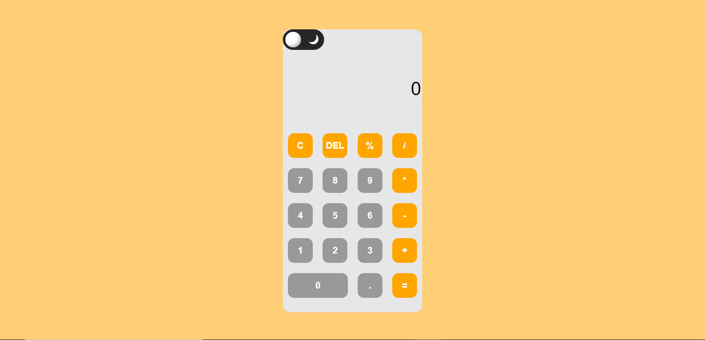

# Calculator-App

🧮 A Simple Calculator App with Arithmetic Functionalities
  

## 📖 Overview

The Calculator App is a web-based application designed to perform basic arithmetic operations such as addition, subtraction, multiplication, and division. It provides a user-friendly interface with a sleek design, allowing users to perform calculations quickly and efficiently.

## ✨ Key Features

- **➕ Addition**: Perform addition operations by entering two numbers and clicking the "+" button.
- **➖ Subtraction**: Perform subtraction operations by entering two numbers and clicking the "-" button.
- **✖️ Multiplication**: Perform multiplication operations by entering two numbers and clicking the "×" button.
- **➗ Division**: Perform division operations by entering two numbers and clicking the "÷" button.
- **🔄 Clear**: Clear the input fields and reset the calculator to its initial state.
- **📱 Responsive Design**: The calculator app is fully responsive and adapts to different screen sizes and devices.
- **🌓 Light/Dark Mode**: Toggle between light and dark mode to customize the app's appearance.

The calculator app features a modern and intuitive design that starts in light mode by default. This light mode provides a clean and crisp interface, making it easy to use and visually appealing. Users can toggle to dark mode if desired, which adjusts the color scheme and provides a different aesthetic.

## 🚀 Live Demo

Check out the live demo of the Calculator App [here](https://your-demo-url.com).

## ⚙️ Installation

1. Clone this repository.
2. Open the `index.html` file in your preferred web browser.

## 🛠️ Technologies Used

- HTML5
- CSS3
- JavaScript
